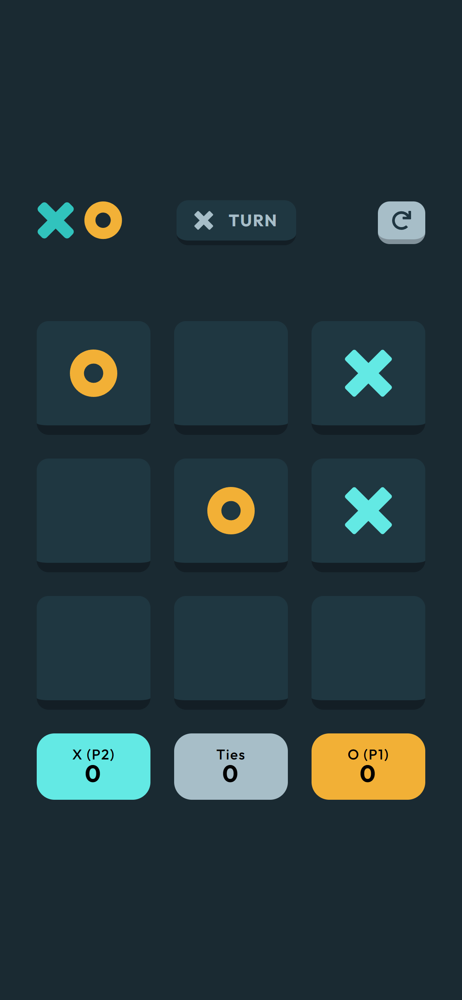
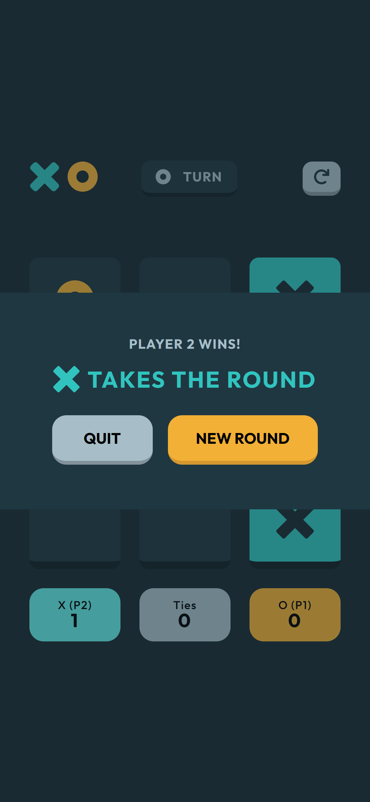

# Tic Tac Toe

## Project Description

Try Game:


https://frontendmentor-tic-tac-toe-4yx3.vercel.app/

## Description

| Menu                           | Second Header                  | Second Header                  |
| ------------------------------ | ------------------------------ | ------------------------------ |
|  |  |  |

Tic-Tac-Toe is a two-player game played on a 3×3 grid,
where players take turns marking a space with their symbol
— one player uses X and the other uses O.
The objective is to be the first player to get three of their symbols in a row
— horizontally, vertically, or diagonally.
If all nine spaces are filled without either player achieving three in a row,
the game ends in a draw.
You have 2 way of play: with another player or with CPU.
For CPU was used a MINMAX algorithm

## Development

How to install project:

```
git clone https://github.com/aga-siwek/tic-tac-toe-game
cd tic-tac-toe-game
npm install
npm run dev
```
